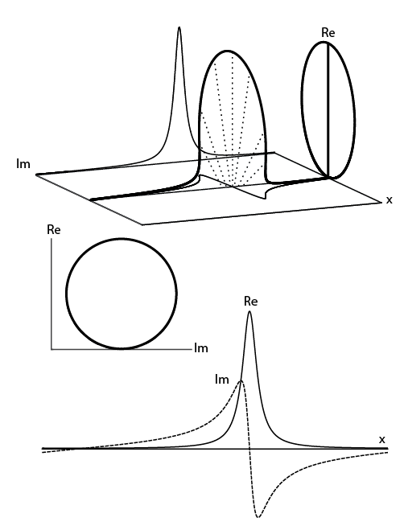
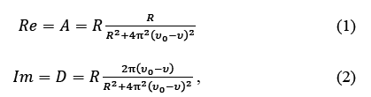

# Complex Lorentzian

To the glory of 

,

the mother of all phased or unphased Lorentzian signals in NMR spectroscopy.


3D representation:



Seen from the side (DISPA reprensentation) it draws a circle! 

Not very surprising when remembering that




(from Jeannerat, D. [Analysis of the Phases of Signals in Two-Dimensional NMR. In eMagRes](https://archive-ouverte.unige.ch/unige:93864/ATTACHMENT01); Encyclopedia of Magnetic Resonance; Wiley, 2017.)

## Octave/Matlab program 
Make your owne 3D representation of a complex Lorentzian in Matlab or Octave
```octave
t=-100:0.1:100;
com=1./(1+i*t);
plot3(t,imag(com),real(com));
```
## 3D printing of 3D represation of 1D spectra
This sites shows how to generate files for 3D printing, [movies](), etc.
