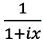

# 3D_DISPA_1D_NMR_spectra

To the glory of 

,

the mother of all phased or unphased Lorentzian signals in NMR spectroscopy.
Seen from the side (DISPA reprensentation) it draws a circle!


##Octave/Matlab program to enjoy a 3D representation of a complex Lorentzian.
```
t=-100:0.1:100;
com=1./(1+i*t);
plot3(t,imag(com),real(com));
```
## More about Lorentzian 
(selected lit.)
Jeannerat, D. [Analysis of the Phases of Signals in Two-Dimensional NMR. In eMagRes](https://archive-ouverte.unige.ch/unige:93864/ATTACHMENT01); Encyclopedia of Magnetic Resonance; Wiley, 2017.

